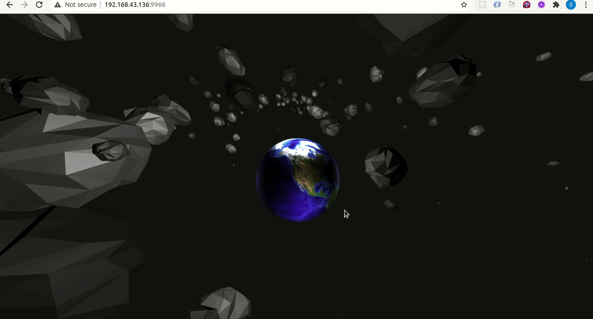

# Asteroids Vsualizer
A web application that Earth planet sorrounded by asteroids.

## :package: Built With

    - Three.js
    - canvas-sketch
    - Webgl

## :computer: Getting Started

    To get a local copy up and running follow these simple steps.


## :arrow_heading_down: Install

1) Clone the repository to your local machine
```sh
$ git clone git@github.com:wathigo/Asteroids-Visualizer.git
```

2) cd into the directory
```sh
$ cd Asteroids-Visualizer
```

3) install dependencies 
```sh
npm install
```

4) Install canvas skecth cli.
```sh
npm i canvas-sketch-cli
```

5) Start canvas sketch server
```sh
canvas-sketch src/sketch.js
```

## :arrow_forward: Usage

<p align="center">
<a href="#">
    
  </a>
</p>


## :busts_in_silhouette: Authors

👤 **Simon Wathigo**

- Linkedin: [Simon Wathigo](https://www.linkedin.com/in/simon-wathigo/)
- Github: [@wathigo](https://github.com/wathigo)

## 🤝 Contributing

    Contributions, issues and feature requests are welcome!

Feel free to check the [issues page](../../issues).

## :star2: Show your support

    Give a ⭐️ if you like this project!

